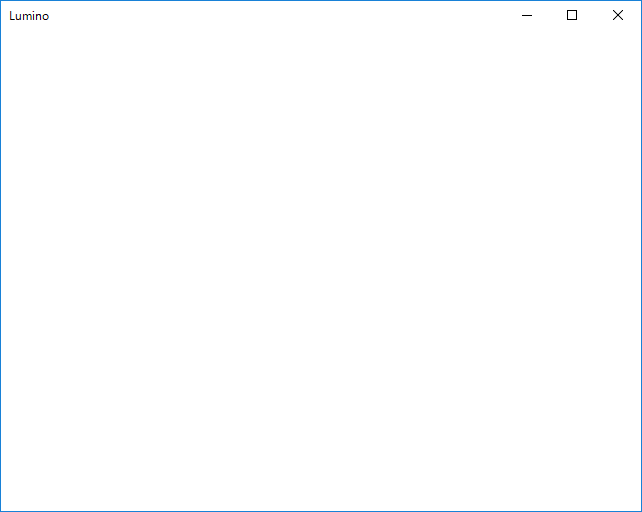

Lumino の基本
==========

チュートリアルを始める前に、Lumino 特有のコードの書き方や特徴を、画像を表示するだけのサンプルプログラムをベースに説明します。


プロジェクトを作成する
----------

TODO:

```
lumino-cli init LuminoTutorial -t SimpleDesktop
```


ウィンドウを表示するだけの最小限のプログラム
----------

プロジェクトを作成したら、プロジェクトフォルダの中にある .sln ファイルを Visual Studio で開いてください。

Main.cpp を開くと、次のようなプログラムが表示されます。

```cpp
#include <Lumino.hpp>

void Main()
{
    while (Engine::update())
    {

    }
}
```

実行すると、次のようなウィンドウが表示されます。



`while (Engine::update())` のループは、ウィンドウが閉じられるまでの間、1秒間に60回の周期で実行され続けます。
Engine::update() はウインドウが閉じられていなければ true を返し、ウインドウ右上の×ボタンを押すなどで閉じられた場合は false を返します。

このループ1回のことを「フレーム」と呼び、この中に

- プレイヤーの入力を確認し、
- キャラクターを移動し、
- ウィンドウに絵を描く

といったプログラムを書くことでゲームを進行させます。


画像を表示する
----------

画像を表示するためには、スプライトと呼ばれるオブジェクトを使用します。

単に画像と言っても、実際のシーンではキャラクターの位置や向き、透明度、アニメーションなど様々な動作が必要になります。スプライトには、そういった操作で必要となる機能が組み込まれています。

次のプログラムは、画像ファイルを読み込み、スプライトを表示します。

```cpp
#include <Lumino.hpp>

void Main()
{
    Ref<Sprite> sprite = Sprite::create(u"icon.png");

    while (Engine::update())
    {
    }
}
```


`Ref` については [C++ プログラミングガイドのメモリ管理](../programming-guide/cpp.md#メモリ管理) を参照してください。

`Sprite::create(u"icon.png")` は、プロジェクトの Assets フォルダの中にある icon.png ファイルを読み込み、スプライトを作成します。

作成したスプライトは、Engine::update() によって画面に描画されます。


まとめ
----------


