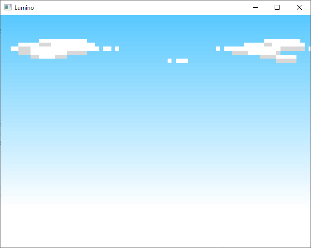
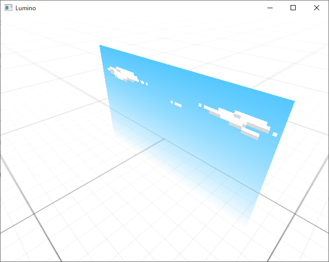

画像を表示する
==========

アセットの準備
----------

ゲームを作るために必要な、画像や音声などの素材のことを `アセット` と呼びます。

まず最初に、次の zip ファイルをダウンロードしてください。

- [Assets.zip](Assets.zip)

この中に、このチュートリアルで作成するゲームのアセットが入っています。

この zip ファイルの中身を、プロジェクトフォルダの中にある Assets というフォルダへ展開してください。

TODO: SS


テクスチャを読み込む
----------

Lumino では画像のことを `テクスチャ` と呼びます。

画像をプログラムで扱うにはまず PNG や JPEG などの画像ファイルを読み込み、テクスチャを作成します。

```cpp
void Main()
{
    Ref<Texture> skyTexture = Assets::loadTexture(u"sky");

    while (Engine::update())
    {
    }
}
```

`Assets::loadTexture` というメソッドで "sky" という名前の画像ファイルを読み込んでテクスチャを作成し、 `Ref<Texture>` という型の変数 skyTexture にテクスチャを格納します。

読み込まれるファイルはプロジェクトの Assets フォルダの中にある sky.png ファイルです。（ファイルの拡張子は省略可能です）

`Ref` は「スマートポインタ」と呼ばれる、ポインタを安全に扱うための機能です。解放忘れをはじめとした問題を防止するために使用します。


### スマートポインタ について

多くの C++ の入門本やサイトでは「new によってオブジェクトを作成し、必ず delete で解放すること」と解説されています。
しかし、スマートポインタを使うことで、オブジェクトが不要になったとき自動的に delete されるようになります。

もう一度、プログラムで確認してみましょう。

```cpp
void Main()
{
    Ref<Texture> skyTexture = Assets::loadTexture(u"sky");

    while (Engine::update())
    {
    }

    // Main を抜けるとき、もう skyTexture は不要になるため、作成したテクスチャは delete される。
}
```

Ref を使っている限り、delete は不要です。というより、必要に応じて自動的に delete されるため **自分で delete してはなりません。**

Ref は Lumino を使う上で非常に重要なキーワードで、今後もたくさん目にすることになります。必ず覚えておいてください。

より詳細な説明は [C++ プログラミングガイドのメモリ管理](../../programming-guide/cpp.md) を参照してください。


画像を表示する
----------

画像を表示するためには、`スプライト` と呼ばれるオブジェクトを使用します。

単に画像と言っても、実際のシーンではキャラクターの位置や向き、透明度、アニメーションなど様々な動作が必要になります。スプライトには、そういった操作で必要となる機能が組み込まれています。

ちょうど、テクスチャを張り付ける透明な板のようなものをイメージしてください。

次のプログラムは、画像ファイルを読み込み、スプライトを表示します。

```cpp
#include <Lumino.hpp>

void Main()
{
    Ref<Texture> skyTexture = Assets::loadTexture(u"sky");
    Ref<Sprite> skySprite = Sprite::create(16, 12, skyTexture);

    while (Engine::update())
    {
    }
}
```

実行すると、次のような画像が表示されます。




`Sprite::create(16, 12, skyTexture)` は、横幅16, 縦幅12 の、先ほど読み込んだテクスチャを表示するスプライトを作成します。

作成したスプライトは、Engine::update() によって自動的に画面に描画されます。


サイズの単位は？
----------

16 や 12 という数字はどのようにして求めたのでしょうか？

Lumino は 3D をベースとしたゲームエンジンです（ただし、3D がメインというより、2D ゲームの表現力を高めるために 3D を利用する、と言った方が正しいかもしれません）。そのため、何らかの描画を行うオブジェクトは基本的に 3D 空間に配置されます。

先のチュートリアルになりますが、[デバッグ](14-debug.md) の機能を使って「カメラ」を操作し、先ほどのスプライトを手前右上の位置から見下ろすと次のように表示されます。



16 や 12 という数字は、このグリッドが示す距離の単位です。 (ちなみに、Lumino はこの 1 つ分を 1 メートルと考えています。これは物理演算を考えるときに重要な単位となってきます)


