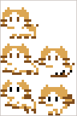
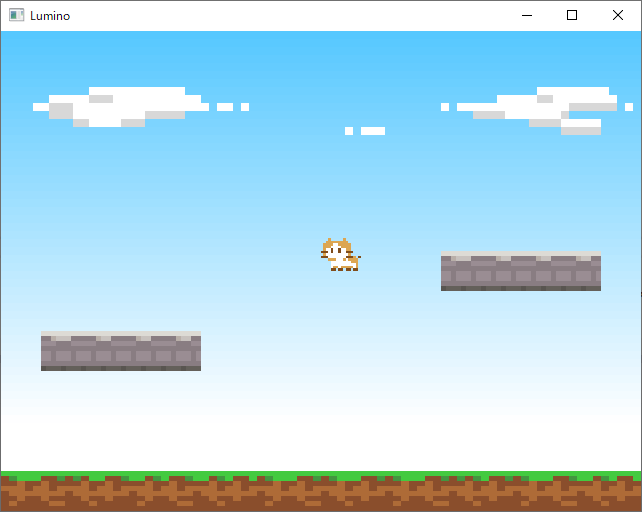
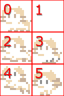
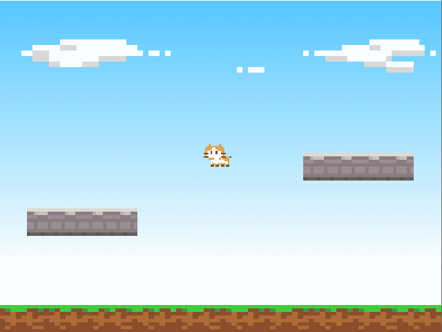

プレイヤーの表示と移動操作
==========


スプライトテクスチャを分割して表示する
----------

アセットのプレイヤー画像ファイル (player.png) には、次のように 5 パターンのアニメーション画像が含まれています。



前回のチュートリアルのように setSourceRect() を使って一部を表示することもできますが、このように小さなパターンがたくさん含まれている場合は管理が大変です。

Lumino では `SpriteFrameSet` クラスを使うことで、同一サイズの小さなパターンをグリッド上に分割して簡単にアクセスできるようになります。

メインループの上に次のコードを追加し、実行してください。

```cpp
Ref<Texture> playerTexture = Assets::loadTexture(u"player");

Ref<SpriteFrameSet> frameSet = SpriteFrameSet::create(playerTexture, 16, 16);

Ref<Sprite> playerSprite = Sprite::create(frameSet);
playerSprite->setFrameIndex(0);
```



`SpriteFrameSet::create(playerTexture, 16, 16)` は、テクスチャを 幅 16px, 型さ 16px でグリッド状の等間隔に分割し、スプライトフレーム (パターン) の集合 (FrameSet) を作成します。

分割されたスプライトフレームは次のように、左上から右下に向かって番号が割り当てられます。



`setFrameIndex` を使ってこの番号を指定することで、スプライトを表示することができます。


キー入力によりプレイヤーを移動する
----------

左右キーの入力により、プレイヤーの画像を左右にスライドさせてみます。

単純にキーが押されているかを確認するには、`Input::isPressed` メソッドを使います。

メインループの周辺を次のように変更し、実行してください。

```cpp
float x = 0.0f;

while (Engine::update())
{
    if (Input::isPressed(u"left"))
    {
        x -= 0.1f;
    }

    if (Input::isPressed(u"right"))
    {
        x += 0.1f;
    }

    playerSprite->setPosition(x, 0);
}
```

左右キーを押すと、プレイヤーのスプライトが移動します。



`Input::isPressed(u"left")` は、左キーが押されている間 true を返します。

メインループは1秒間に60回の頻度で繰り返されることを思い出してください。ループの中でキーが押されているかを確認し、少しずつ座標を移動することで、キャラクターが移動しているように見せることができます。


### Input クラスについて

Input クラスは、ゲームとしての一般的なケースで必要となる入力検出を、簡単に扱うためのクラスです。

上記の例では押されている間を検出しましたが、他にも押された瞬間を検出したり、キーボードだけではなくジョイスティックなどの入力を受け取ることもできます。


コード全体
----------

```cpp
#include <Lumino.hpp>

void Main()
{
    // ワールドの 16x12 の範囲を表示する
    Camera* camera = Engine::mainCamera();
    camera->setProjectionMode(ProjectionMode::Orthographic);
    camera->setOrthographicSize(16, 12);

    // 空
    Ref<Texture> skyTexture = Assets::loadTexture(u"sky");
    Ref<Sprite> skySprite = Sprite::create(skyTexture, 16, 12);

    // 地面
    Ref<Texture> mapTexture = Assets::loadTexture(u"map");
    Ref<Sprite> groundSprite = Sprite::create(mapTexture, 16, 1);
    groundSprite->setSourceRect(0, 0, 80, 8);
    groundSprite->setPosition(0, -5.5, 0);

    // 左の床
    Ref<Sprite> floorSprite1 = Sprite::create(mapTexture, 4, 1);
    floorSprite1->setSourceRect(0, 8, 32, 8);
    floorSprite1->setPosition(-5, -2, 0);

    // 右の床
    Ref<Sprite> floorSprite2 = Sprite::create(mapTexture, 4, 1);
    floorSprite2->setSourceRect(0, 8, 32, 8);
    floorSprite2->setPosition(5, 0, 0);

    // プレイヤー
    Ref<Texture> playerTexture = Assets::loadTexture(u"player");
    Ref<SpriteFrameSet> frameSet = SpriteFrameSet::create(playerTexture, 16, 16);
    Ref<Sprite> playerSprite = Sprite::create(frameSet);
    playerSprite->setFrameIndex(0);

    // メインループ
    float x = 0.0f;
    while (Engine::update())
    {
        if (Input::isPressed(u"left"))
        {
            x -= 0.1f;
        }

        if (Input::isPressed(u"right"))
        {
            x += 0.1f;
        }

        playerSprite->setPosition(x, 0);
    }
}
```
