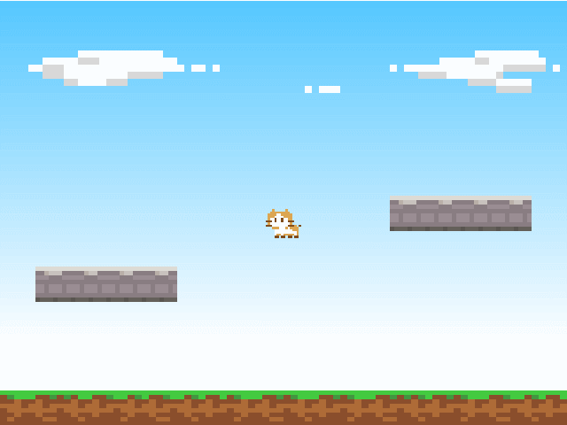

物理演算
==========

アクションゲームではジャンプや衝撃、衝突など、ワールド内のオブジェクトを物理特性によって制御するケースがたくさんあります。
しかし、自然な動きをイチから実装することは簡単ではありません。

Lumino では、スプライトなどワールド内のオブジェクトにいくつかの物理設定を行うことで、自然な動きを表現できるようになります。


プレイヤーに剛体を追加する
----------

剛体とは物理演算を構成する要素のひとつで、物体の性質や姿勢を表現します。

まずはプレイヤーのスプライトに剛体を追加し、自由落下させてみましょう。

メインループの上に次のコードを追加します。

```cpp
Ref<RigidBody2DComponent> playerBody = RigidBody2DComponent::create();
playerBody->addCollisionShape(BoxCollisionShape2D::create(1, 1));
playerBody->setMass(2);
playerBody->setFixedRotation(true);
playerSprite->addComponent(playerBody);
```

また、プレイヤーの移動処理は物理演算のシステムに任せるため、前回のチュートリアルで作成したプログラムから移動部分を削除しておきます。


```diff
- float x = 0.0f;

while (Engine::update())
{
    if (Input::isPressed(u"left"))
    {
-        x += 0.1f;
    }

    if (Input::isPressed(u"right"))
    {
-        x -= 0.1f;
    }

-    playerSprite->setPosition(x, 0);
}
```

プレイヤーは落下するようになりましたが、画面外へ落ちてしまうはずです。



これは次のセクションで地面にも剛体を追加することで解決しますが、まずはコードの説明をします。


地形に静的な剛体を追加する
----------


コード全体
----------


